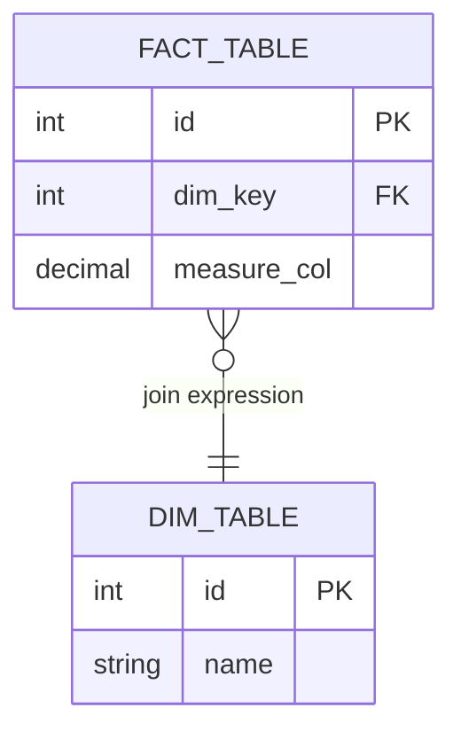

# BO Universe → ER Diagram Migration Skill

Guides the end-to-end pipeline for extracting SAP BusinessObjects universe structure from exported
XML and producing context-scoped ER diagrams to drive a Databricks Gold layer build and eventual
Power BI semantic model design.

---

## Pipeline Overview

```
Universe XML export (.unx renamed to .zip, extracted)
    → Step 1: Parse XML → structured JSON
    → Step 2: Group by context
    → Step 3: Identify shared dimensions
    → Step 4: Generate one Mermaid ER diagram per context
    → Step 5: Generate shared dimensions ER diagram
    → Step 6: Generate annotation files
    → Output: /er_diagrams/ + /annotations/
```

---

## Output Artifact Structure

```
/universe_extraction/
    /parsed/
        tables.json               ← all physical + alias + derived tables
        joins.json                ← all joins with cardinality + context membership
        contexts.json             ← context definitions + member table/join lists
        aggregate_tables.json     ← agg tables + their base fact + grain
    /er_diagrams/
        shared_dimensions.mmd     ← conformed dims used by 2+ contexts
        context_<name>.mmd        ← one file per context
    /annotations/
        derived_tables.md         ← tables to build as views in Databricks
        aggregate_awareness.md    ← agg tables to build as Gold layer rollups
        alias_tables.md           ← alias tables + their source table
```

---

## Step 1 — Parse Universe XML

The `.unx` file is a ZIP archive. If not already extracted:

```bash
cp universe.unx universe.zip && unzip universe.zip -d universe_extracted/
```

The XML files of interest are typically inside `universe_extracted/` — look for files containing
`<Tables>`, `<Joins>`, `<BusinessLayer>`, `<Contexts>`.

### Python Parser

Run `scripts/parse_universe.py` against the extracted XML directory.

**What it extracts:**

| JSON File | Key Fields |
|---|---|
| `tables.json` | `name`, `type` (physical/alias/derived), `sql` (for derived), `source_table` (for alias) |
| `joins.json` | `table1`, `table2`, `expression`, `cardinality`, `outer_join`, `contexts[]` |
| `contexts.json` | `name`, `tables[]`, `joins[]` |
| `aggregate_tables.json` | `name`, `base_fact_table`, `grain`, `compatible_objects[]` |

See `scripts/parse_universe.py` for implementation. Run as:

```bash
python scripts/parse_universe.py \
  --input ./universe_extracted \
  --output ./parsed
```

---

## Step 2 — Group by Context

Each context in `contexts.json` defines a **subject area boundary**. This drives all downstream
artifacts — one context = one ER diagram = one Databricks Gold schema = one Power BI semantic model.

**Decision rule for table assignment:**
- Table appears in **one context only** → belongs to that context
- Table appears in **two or more contexts** → candidate for `shared_dimensions`
- Fact tables are typically context-specific; dimension tables are often shared

---

## Step 3 — Identify Shared Dimensions

A shared dimension is any table that:
1. Appears in 2 or more contexts, **and**
2. Is not a fact table (no measures / not at transaction grain)

These go into `shared_dimensions.mmd` and map to a conformed `dim_*` schema in Databricks.

---

## Step 4 — Generate Context ER Diagrams

For each context, generate a Mermaid ER diagram. Run `scripts/generate_er.py`:

```bash
python scripts/generate_er.py \
  --parsed ./parsed \
  --output ./er_diagrams
```

### Mermaid ER Template (per context)



**Cardinality mapping from BO to Mermaid:**

| BO Cardinality | Mermaid Notation |
|---|---|
| 1..1 | `||--||` |
| 1..N | `||--o{` |
| N..1 | `}o--||` |
| N..N | `}o--o{` |
| Outer join | Append `(outer)` to label |

### Annotations to include in diagram comments

```mermaid
%% Context: Sales
%% Aggregate tables: AGG_SALES_DAILY (grain: day), AGG_SALES_MONTHLY (grain: month)
%% Derived tables: V_SALES_ADJUSTED → build as view in Databricks
%% Alias tables: SHIP_ADDRESS → source: ADDRESS
```

---

## Step 5 — Generate Shared Dimensions ER Diagram

Same process as Step 4 but scoped to shared dimension tables only.
This diagram maps to:
- A `dim_*` schema in Databricks (built once, referenced by all domains)
- A shared/certified semantic model in Power BI (referenced by all domain models via composite models)

---

## Step 6 — Generate Annotation Files

### `derived_tables.md`
For each derived table, document:
- Original SQL from the universe
- Recommended Databricks implementation (view vs. materialized table)
- Which context(s) use it

### `aggregate_awareness.md`
For each aggregate table, document:
- Base fact table
- Grain (day / month / region / product etc.)
- Compatible BO objects (these become the measure scope in Power BI)
- Recommended Databricks Gold layer table name

### `alias_tables.md`
For each alias table, document:
- Source (physical) table
- Role it plays in this context (e.g., `SHIP_ADDRESS` = shipping address role of `ADDRESS`)
- Power BI equivalent: inactive relationship + `USERELATIONSHIP()` in DAX, or separate view in Databricks

---

## Downstream Mapping Guide

### BO → Databricks

| BO Element | Databricks Gold Equivalent |
|---|---|
| Physical table | Source table (Silver layer) or Gold table |
| Derived table | View or materialized Gold table |
| Aggregate table | Gold rollup table (partitioned by grain) |
| Alias table | View with role-specific name |
| Context | Gold schema / domain folder |
| Shared dimension | Conformed `dim_*` table in shared schema |

### BO → Power BI (for later phase)

| BO Element | Power BI Equivalent |
|---|---|
| Context | Semantic model (one per context) |
| Shared dimensions | Shared certified semantic model |
| Measure objects | DAX measures |
| Dimension objects | Columns / calculated columns |
| Derived table | Power Query (M) step or calculated table |
| Aggregate table | Power BI Aggregation Table (Premium/Fabric) |
| Alias table | Inactive relationship + `USERELATIONSHIP()` |
| Prompt/filter | Slicer or RLS |
| Context loop resolution | Clean star schema in Databricks (preferred) |

---

## Scripts Reference

| Script | Purpose |
|---|---|
| `scripts/parse_universe.py` | Parse universe XML → JSON |
| `scripts/generate_er.py` | JSON → Mermaid ER diagrams |
| `scripts/validate_er.py` | Cross-check all tables, joins, contexts, and annotations are fully covered |

### validate_er.py — Checks Performed

| Check | What It Validates |
|---|---|
| Context diagram count | Every context in `contexts.json` has a matching `.mmd` file |
| All tables covered | Every table in `tables.json` appears in at least one diagram |
| All joins covered | Every join in `joins.json` appears in at least one diagram |
| Context table completeness | Each context diagram contains all its expected tables |
| Context join completeness | Each context diagram contains all its expected joins |
| Derived tables annotated | Every derived table has a `%% Derived table:` comment in a diagram |
| Aggregate tables annotated | Every aggregate table has a `%% Aggregate table:` comment in a diagram |
| Alias tables annotated | Every alias table has a `%% Alias table:` comment in a diagram |
| Shared dimensions diagram | `shared_dimensions.mmd` exists and covers all multi-context tables |

Run as:

```bash
python scripts/validate_er.py \
  --parsed ./parsed \
  --er_diagrams ./er_diagrams \
  --report ./validation_report.json
```

Exit code `0` = all checks passed. Exit code `1` = one or more failures.
The optional `--report` flag writes a machine-readable JSON report for CI integration.

See `scripts/` directory for implementations.

---

## Quality Checks Before Handoff

- [ ] Every table in the universe appears in at least one ER diagram
- [ ] Every join has a cardinality annotation
- [ ] All derived tables documented in `derived_tables.md`
- [ ] All aggregate tables documented in `aggregate_awareness.md`
- [ ] All alias tables documented with their source table
- [ ] Shared dimensions diagram covers all tables appearing in 2+ contexts
- [ ] Context count in `contexts.json` matches number of `context_*.mmd` files generated
